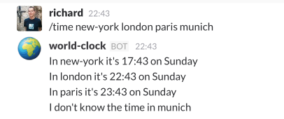

# Example Slack Command via AWS Lambda using Scala

This example is not far from the echo example [that AWS provide](https://aws.amazon.com/about-aws/whats-new/2015/12/aws-lambda-launches-slack-integration-blueprints/), but in Scala.

It does a little bit more, in that it gives a world clock via \time:



## To install into an existing Lambda/API Gateway environment

```
sbt assembly
```

...and deploy the JAR to your Lambda environment. The function name is: `example.Slack::time`
